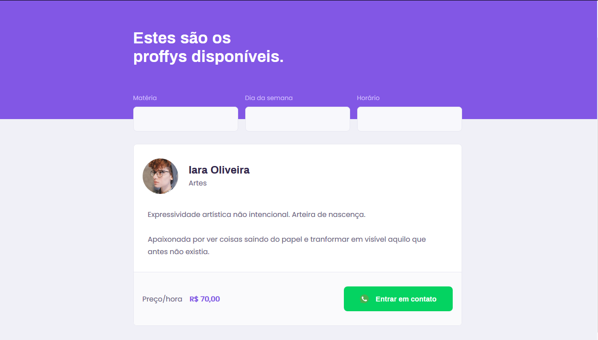

<div align="right" >
  <a href="./README.pt.md">
    </img>
  </a>
</div>
<br/>

<div align="center">
 
</div>

<br/>
<p align="center">
 <a href="#about">About</a>  • 
 <a href="#technologies">Technologies</a>  •  
 <a href="#how-to-run">How to run</a>  •  
 <a href="#license">License</a>  •  
 <a href="#author">Author</a>
</p>


<a name="about"/>

## :bulb: About the project

<br/>

<div align="center">
  
  <span>Project avaiable on <a href="https://www.figma.com/file/GHGS126t7WYjnPZdRKChJF/Proffy-Web?node-id=0%3A1">Figma</a></span>
	
  <span>Teachers list on web application</span>
</div>

Proffy is an online platform that connects teachers and students.

This application was developed during the second edition of <strong>Next Level Week</strong> distributed by [Rocketseat](https://rocketseat.com.br/).


<br/>
<a name="technologies"/>

## :rocket: Technologies

This project is made with:

. [TypeScript](https://www.typescriptlang.org/)<br/>

. [ReactJS](https://reactjs.org/)<br/>

. [Node.js](https://nodejs.org/en/)<br/>


<br/>
<a name="how-to-run"/>

## :computer: How to run


FIRST OF ALL

. You will need to have `node.js` installed in you machine; <br/>
. Also, it's very important to have a package manager, you can use `yarn` or `npm`; <br/>


CLONE THIS REPOSITORY

```sh

$ git clone https://github.com/iaraoliveira/proffy.git

```

INSTALLING THE DEPENDENCIES

```sh

# run this if you're using yarn
$ yarn

# or this if you're using npm
$ npm install

```

RUN THE APPLICATION

```sh

# go to server directory
$ cd server

# initialize your database
$ yarn knex:migrate

# run server
$ yarn start

```

```sh

# go to web directory
$ cd web

# run web frontend
$ yarn start

```

<br/>
<a name="license"/>

## :notebook_with_decorative_cover: License

This project is under the MIT license, you can read more about it in [LICENSE](./LICENSE)


<br/>
<a name="author"/>

<div align='center'>
  <strong>With :white_heart: by iara</strong>
  <br/>
  <a href="https://www.linkedin.com/in/iara/">Let's talk</a>
</div>

